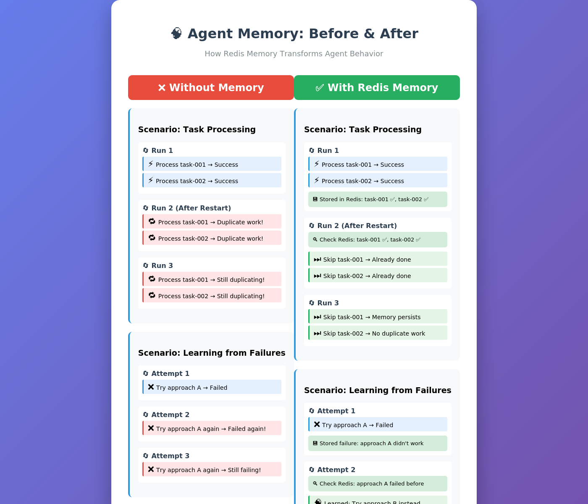

## Memory and State

```shell
$ docker compose up --build
```

You'll see the agent start with Redis ready:

```
 => => exporting config sha256:811fa2f874a038286a77c20f5f831da8968b85dc446fe02a8e3dc938c30  0.0s
 => => exporting attestation manifest sha256:5dca18d80903a3bc28c3cd088e85edfa2f2a8b31bc0e7  0.0s
 => => exporting manifest list sha256:c298425c36a5e7823d1b769433961ed6333f744fe5862424d104  0.0s
 => => naming to docker.io/library/memory-state-task-agent:latest                           0.0s
[+] up 12/13king to docker.io/library/memory-state-task-agent:latest                        0.2s
[+] up 16/17is:7-alpine  Pulled                                                             5.9s
 ✔ Image redis:7-alpine                Pulled                                               5.9s
 ✔ Image memory-state-task-agent       Built                                               11.2s
 ⠇ llm                                 Configuring                                          8.8s
 ✔ Network memory-state_default        Created                                              0.0s
 ✔ Volume memory-state_agent-state     Created                                              0.0s
 ✔ Container memory-state-agent-memory-1 Healthy                                            5.8s
 ✔ Container memory-state-task-agent-1 Created
```

<br/>

### Verify memory persistence:

```shell
// List all memory keys
$ docker compose exec agent-memory redis-cli KEYS "agent:*"
```

<br/>

## Result:

```
1) "agent:task-processor:actions:task-001"
```

<br/>

### You can also view the specific task history:

```shell
// View specific task history
$ docker compose exec agent-memory redis-cli LRANGE agent:task-processor:actions:task-001 0 -1 | jq
```

<br/>

### Result:

```json
{
  "action": "Extract key insights from the customer feedback data using statistical techniques, such as correlation analysis and clustering, to identify trends and patterns.",
  "result": "Successfully completed: Extract key insights from the customer feedback data using statistical techniques, such as correlation analysis and clustering, to identify trends and patterns.",
  "success": true,
  "timestamp": "2026-10-05T01:14:01.061978"
}
```

<br/>


<br/>




# Manual Verification Guide

Follow these steps to manually verify that agent memory works.

## Step 1: Start the System

```bash
docker compose up --build
```

**Expected output:**
```
🚀 Starting Task Agent with Memory

📊 Configuration:
   Redis: redis://agent-memory:6379
   Agent: task-processor
   Model: ai/smollm2:360m-instruct-q4_K_M

🔍 PERCEIVE: Checking for tasks...
   Found new task: task-001 - Process customer feedback data
   Found new task: task-002 - Generate monthly report
   Found new task: task-003 - Handle error in payment system
   Found new task: task-004 - Update user documentation

🤖 AGENT LOOP STARTED for Task: task-001
...
📝 Remembered: Task task-001 - Process customer feedback data - ✅ Success
```

## Step 2: Verify Memory Storage

Open a new terminal and run:

```bash
# Access Redis
docker compose exec agent-memory redis-cli

# Check stored keys
127.0.0.1:6379> KEYS agent:*
1) "agent:task-processor:actions:task-001"
2) "agent:task-processor:actions:task-002"
3) "agent:task-processor:actions:task-003"
4) "agent:task-processor:actions:task-004"

# View task-001 details
127.0.0.1:6379> LRANGE agent:task-processor:actions:task-001 0 -1
1) "{\"action\":\"Process customer feedback data\",\"result\":\"Successfully completed\",\"success\":true,\"timestamp\":\"2025-12-26T10:30:00\"}"

# Exit Redis
127.0.0.1:6379> exit
```

**✅ Verification:** You should see memory keys in Redis containing task actions.

## Step 3: Test Memory Persistence

Stop the agent (Ctrl+C in the first terminal), then restart:

```bash
docker compose restart task-agent
docker compose logs -f task-agent
```

**Expected output:**
```
🔍 PERCEIVE: Checking for tasks...
   ⏭️  Skipping already completed task: task-001
   ⏭️  Skipping already completed task: task-002
   ⏭️  Skipping already completed task: task-004
```

**✅ Verification:** Agent skips tasks it already completed.

## Step 4: Test Volume Persistence

Stop everything and remove containers (but keep volumes):

```bash
docker compose down
# Note: Volumes are NOT removed by default
```

Now start again:

```bash
docker compose up
```

**Expected output:**
```
🔍 PERCEIVE: Checking for tasks...
   ⏭️  Skipping already completed task: task-001
   ⏭️  Skipping already completed task: task-002
   ...
```

**✅ Verification:** Memory survived container removal.

## Step 5: Test Complete Reset

To prove volume persistence, try a complete reset:

```bash
# Remove everything including volumes
docker compose down -v

# Start fresh
docker compose up
```

**Expected output:**
```
🔍 PERCEIVE: Checking for tasks...
   Found new task: task-001 - Process customer feedback data
   Found new task: task-002 - Generate monthly report
   ...
```

**✅ Verification:** With volumes removed, memory is reset and agent processes tasks again.

## Step 6: Inspect Memory Contents

```bash
# See all memory
docker compose exec agent-memory redis-cli KEYS "agent:*"

# Get detailed JSON for a task
docker compose exec agent-memory redis-cli LRANGE agent:task-processor:actions:task-001 0 -1

# Count total actions stored
docker compose exec agent-memory redis-cli LLEN agent:task-processor:actions:task-001
```

## Step 7: Test Failure Memory

The agent remembers failed attempts. Task-003 is designed to fail:

```bash
docker compose logs task-agent | grep "task-003"
```

**Expected output:**
```
Found new task: task-003 - Handle error in payment system
🧠 REASON: Analyzing task task-003...
   Previous failed attempts:
   - Attempt 1: Error: Failed to process
❌ Failed
📝 Remembered: Task task-003 - ... - ❌ Failed
🔁 Attempt 1/3 failed. Will retry with different approach.
```

**✅ Verification:** Agent remembers failures and adapts approach.

## Common Issues

### Issue: "Connection refused to Redis"

**Solution:**
```bash
# Check Redis is running
docker compose ps

# Check Redis health
docker compose exec agent-memory redis-cli ping
# Should return: PONG
```

### Issue: "Memory not persisting"

**Solution:**
```bash
# Check appendonly is enabled
docker compose exec agent-memory redis-cli CONFIG GET appendonly
# Should return: appendonly yes

# Verify volume exists
docker volume ls | grep agent-state
```

### Issue: "Tasks processed multiple times"

**Solution:**
```bash
# Check if memory writes are working
docker compose exec agent-memory redis-cli KEYS "agent:*"

# If empty, check agent logs for Redis connection errors
docker compose logs task-agent | grep -i redis
```

## Success Criteria

✅ **Memory Storage:** Redis contains agent action records  
✅ **Persistence:** Memory survives container restarts  
✅ **Duplicate Prevention:** Agent skips completed tasks  
✅ **Failure Learning:** Agent remembers and adapts from failures  
✅ **Volume Survival:** Memory persists with `docker compose down`  
✅ **Complete Reset:** `docker compose down -v` clears memory  

## Cleanup

```bash
# Stop and remove everything
docker compose down -v

# Remove images
docker compose down --rmi all
```

---

**If all steps pass:** Memory system is working correctly! ✅
