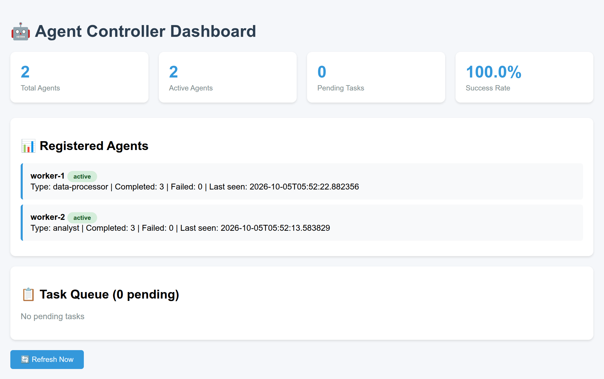

## Component 4: Agent Controller (Multi-Agent Orchestration System)

A complete working example of an **Agent Controller** that manages multiple autonomous agents, coordinates tasks, and provides real-time monitoring.

## What This Demonstrates

**Agent Registration** - Agents self-register with the controller  
**Task Queue Management** - Centralized task distribution  
**Agent Monitoring** - Real-time health checks and status tracking  
**Load Balancing** - Tasks automatically distributed to available agents  
**Failure Recovery** - Automatic agent restarts on failure  
**Web Dashboard** - Visual monitoring of entire system  
**REST API** - Programmatic control of agents and tasks  

## Architecture

```
┌─────────────────────────────────────────────────────┐
│              Agent Controller                       │
│  - REST API (port 8000)                             │
│  - Web Dashboard                                    │
│  - Task Queue Management                            │
│  - Agent Health Monitoring                          │
└──────────────┬──────────────────────────────────────┘
               │
       ┌───────┴──────────┬────────────┐
       │                  │            │
   ┌───▼───┐          ┌───▼───┐    ┌───▼───┐
   │Worker │          │Worker │    │Worker │
   │  #1   │          │  #2   │    │  #3   │
   │(Data) │          │(Analyst)   │  ...  │
   └───┬───┘          └───┬───┘    └───┬───┘
       │                  │            │
       └───────┬──────────┴────────────┘
               │
        ┌──────▼───────┐
        │    Redis     │
        │  (Memory)    │
        └──────────────┘
```

## Quick Start

```bash
// Start the entire system
$ docker compose up --build
```

<br/>

```
// Access the dashboard
open http://localhost:8001
```

<br/>



<br/>


**You should see:**
- Controller starts and creates demo tasks
- Worker agents register themselves
- Agents pull and process tasks
- Dashboard shows real-time status

## Dashboard Features

The web dashboard at `http://localhost:8001` shows:

1. **System Stats**
   - Total Agents
   - Active Agents
   - Pending Tasks
   - Success Rate

2. **Agent List**
   - Agent name and type
   - Active/Inactive status
   - Tasks completed/failed
   - Last heartbeat time

3. **Task Queue**
   - Pending tasks
   - Task descriptions
   - Assigned types

**Auto-refreshes every 5 seconds!**

<br/>

## REST API

### Agent Management

```bash
// Get all agents
$ curl http://localhost:8001/api/agents
[
  {
    "last_heartbeat": "2026-10-05T06:00:43.341709",
    "name": "worker-1",
    "registered_at": "2026-10-05T05:47:32.676292",
    "status": "active",
    "tasks_completed": 3,
    "tasks_failed": 0,
    "type": "data-processor"
  },
  {
    "last_heartbeat": "2026-10-05T06:00:34.048558",
    "name": "worker-2",
    "registered_at": "2026-10-05T05:47:32.677491",
    "status": "active",
    "tasks_completed": 3,
    "tasks_failed": 0,
    "type": "analyst"
  }
]
```

<br/>

```
// Register a new agent
$ curl -X POST http://localhost:8001/api/agents/register \
  -H "Content-Type: application/json" \
  -d '{"name": "worker-3", "type": "specialist"}'
```

<br/>

```json
{
  "last_heartbeat": "2026-10-05T06:01:36.637147",
  "name": "worker-3",
  "registered_at": "2026-10-05T06:01:36.637141",
  "status": "active",
  "tasks_completed": 0,
  "tasks_failed": 0,
  "type": "specialist"
}

```

<br/>

```
// Send heartbeat
$ curl -X POST http://localhost:8001/api/agents/worker-1/heartbeat
```

<br/>

```json
{
  "status": "ok"
}
```

<br/>

### Task Management

```bash
// Get task queue
$ curl http://localhost:8001/api/tasks
```

<br/>

```json
[]
```

<br/>

```
// Assign a new task
$ curl -X POST http://localhost:8001/api/tasks/assign \
  -H "Content-Type: application/json" \
  -d '{"id": "task-123", "description": "Analyze data", "type": "analyst"}'
```

<br/>

```json
{
  "assigned_type": "analyst",
  "created_at": "2026-10-05T06:03:02.545649",
  "description": "Analyze data",
  "id": "task-123",
  "status": "pending"
}
```

<br/>

```
// Agent requests next task
$ curl -X POST http://localhost:8001/api/tasks/dequeue \
  -H "Content-Type: application/json" \
  -d '{"agent_name": "worker-1"}'
```

<br/>

```json
{
  "status": "no_tasks"
}
```

<br/>

```
// Mark task complete
$ curl -X POST http://localhost:8001/api/tasks/task-123/complete \
  -H "Content-Type: application/json" \
  -d '{"success": true, "result": "Analysis complete"}'
```

<br/>

```json
{
  "status": "ok"
}
```

<br/>

### System Stats

```bash
// Get system statistics
$ curl http://localhost:8001/api/stats
```

<br/>


```json
{
  "active_agents": 2,
  "inactive_agents": 1,
  "pending_tasks": 0,
  "success_rate": 100.0,
  "total_agents": 3,
  "total_completed": 7,
  "total_failed": 0
}
```

<br/>

## Testing the System

### Test 1: Verify Agents Register

```bash
// Start system
$ docker compose up -d

// Wait a few seconds, then check
$ curl http://localhost:8001/api/agents | jq

// Expected: 2 agents (worker-1, worker-2)
```

<br/>

### Test 2: Add Tasks Dynamically

```bash
// Add a new task
$ curl -X POST http://localhost:8001/api/tasks/assign \
  -H "Content-Type: application/json" \
  -d '{"id": "manual-001", "description": "Process urgent data", "type": "data-processor"}'

// Watch logs to see which agent picks it up
$ docker compose logs -f worker-1 worker-2
```

<br/>

### Test 3: Agent Failure Recovery

```bash
// Kill an agent
$ docker compose kill worker-1

// Watch dashboard - agent goes inactive
// Docker restarts it automatically (restart: on-failure)
// Agent re-registers with controller
$ docker compose logs -f worker-1
```

<br/>

### Test 4: Scale Agents

```bash
// Add more workers
$ docker compose up -d --scale worker-2=3

// Check dashboard - 4 agents total now
```

## 📁 File Structure

```
agent-controller/
├── docker-compose.yml      # Defines all services
├── controller.py           # Controller with REST API
├── agent.py               # Worker agent logic
├── Dockerfile.controller   # Controller container
├── Dockerfile.agent        # Agent container
├── requirements.txt        # Python dependencies
└── README.md              # This file
```

## 🔄 Agent Lifecycle

### 1. Startup
```
Agent starts → Waits for controller → Registers → Sends heartbeat
```

### 2. Task Processing Loop
```
Request task → Process with LLM → Report result → Repeat
```

### 3. Heartbeat
```
Every 10 iterations → Send heartbeat → Controller marks as active
```

### 4. Failure
```
Agent crashes → Docker restarts → Re-register → Resume work
```

