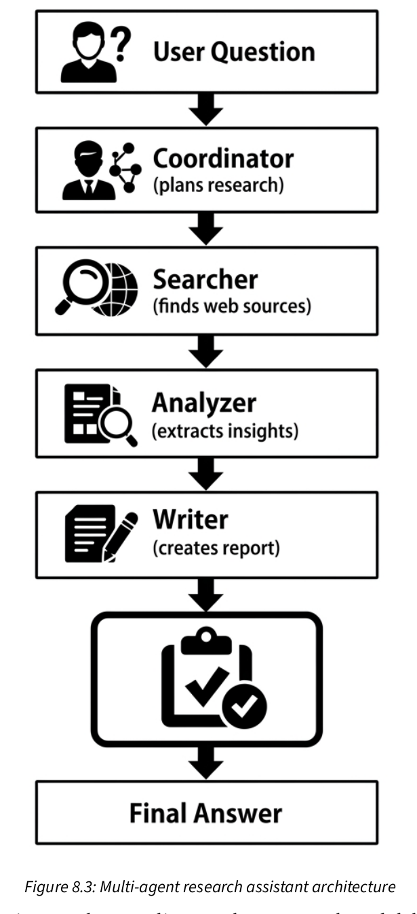

# Глава 08. Архитектуры с несколькими моделями и агентами

### Ключ API Firecrawl

https://firecrawl.dev/

Мы создадим исследовательского помощника, который умеет искать информацию в интернете, анализировать результаты и составлять связные отчёты. Он будет состоять из четырёх специализированных сервисов: координатора, поискового агента, аналитика и автора.

Сначала разберёмся, почему разделение системы на несколько агентов обеспечивает лучшую масштабируемость, снижает затраты и упрощает отладку по сравнению с монолитной архитектурой. Затем определим общую архитектуру: агенты будут взаимодействовать через Redis и HTTP API. После этого с помощью Docker Compose создадим структуру всего проекта.

Каждый агент будет работать как независимый сервис Flask со своей задачей: координатор планирует поисковые запросы, поисковый агент получает данные из интернета с помощью API Firecrawl, аналитик извлекает из результатов структурированные выводы, а автор готовит итоговый отчёт. Мы настроим для каждой роли подходящую модель, упакуем агентов в контейнеры с помощью Dockerfile и будем управлять ими через Compose.

В завершение проверим весь конвейер и проследим выполнение запроса от начала до конца, чтобы понять, как агенты взаимодействуют при подготовке итогового ответа.

 

 

Это полноценная мультиагентная система. У каждого агента своя задача и подходящая для неё модель; кроме того, каждого агента можно масштабировать независимо.
