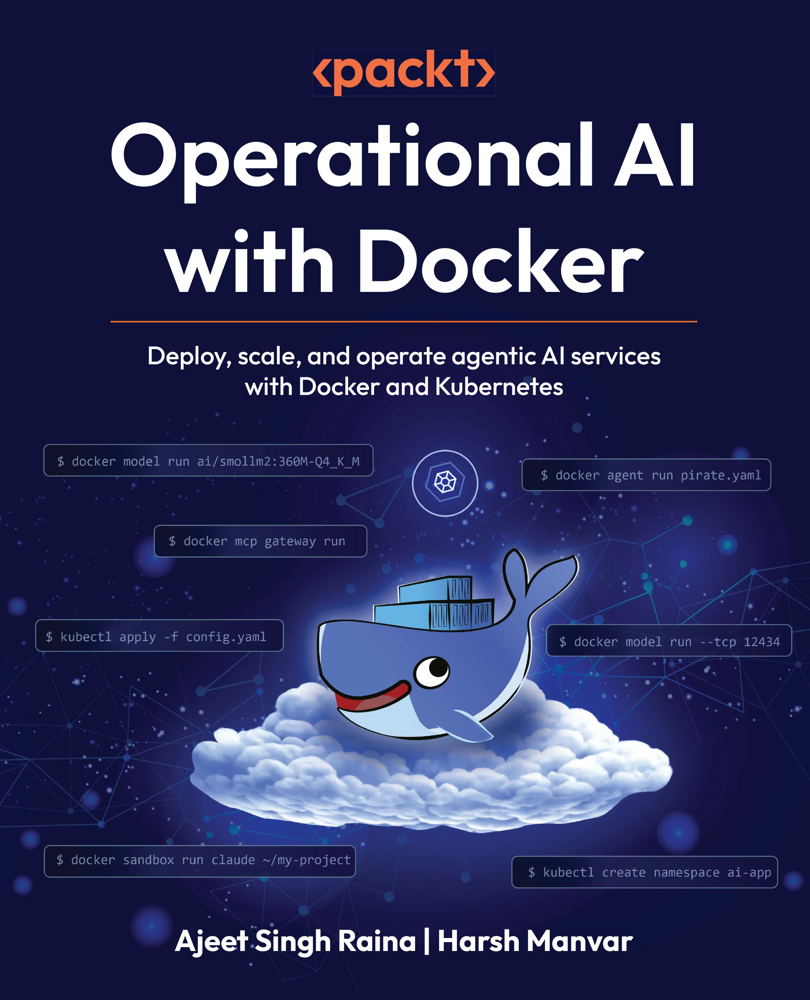

# [Book] [Ajeet Singh Raina, Harsh Manvar] Operational AI with Docker: LLMOps, Agents and Multi-Model Systems with Docker and Kubernetes [ENG, 2026]

> Build, deploy and scale production-ready AI applications using Docker's integrated AI toolkit.

**Original src:**  
https://github.com/PacktPublishing/Operational-AI-with-Docker

This book is for DevOps engineers, platform engineers, AI/ML engineers, solutions architects and developers who want to operationalize AI applications. Whether you're deploying your first LLM or building complex multi-agent systems, this book provides practical guidance for production AI with Docker.

## Chapter guide

| #   | Chapter                                   | What's inside                                                                                                                                                                                                                                                        |
| --- | ----------------------------------------- | -------------------------------------------------------------------------------------------------------------------------------------------------------------------------------------------------------------------------------------------------------------------- |
| 1   | Introduction to Containerisation for AI   | Docker fundamentals through an AI/ML lens — images, containers, registries and how containers compare to VMs. Two small examples (`tiny-service-container`, `tiny-training-run`) get you comfortable with `docker run` and `docker build` before things get serious. |
| 2   | Understanding AI Models in Docker         | The bridge between "I know Docker" and "I know how to ship models". Covers OCI artifacts, GGUF format, quantization and the new Compose `models:` provider syntax for declaring model dependencies alongside your services.                                          |
| 3   | Model Serving with Docker Model Runner    | The heart of the local-LLM workflow. Pull models from Docker Hub, hit them with the OpenAI-compatible API, build a React chatbot and wire up Prometheus, Grafana and Jaeger for observability. Includes Python and JavaScript SDK examples.                          |
| 4   | Docker Offload                            | Push the heavy stuff — model export, quantization, batch jobs — into purpose-built containers so your main app stays snappy. Includes a working `export_and_quantize.py` pipeline.                                                                                   |
| 5   | Running ML Container Models on Kubernetes | Take your containerized models to a real cluster. Manifests, resource limits, autoscaling and a small ML ecosystem you can deploy end to end.                                                                                                                        |
| 6   | Protocol-Based AI Integration with MCP    | Give your models hands. Use Docker MCP Gateway and the MCP Catalog (270+ servers) to connect AI to databases, APIs and tools — with proper isolation, secret management and OAuth.                                                                                   |
| 7   | Building Autonomous AI Agents             | Move from "AI that answers" to "AI that does". Container-isolated agents, agent-to-agent communication, discovery, memory/state, reasoning, tool access and sandboxing — each in its own subfolder.                                                                  |
| 8   | Multi-Model and Multi-Agent Architectures | When one agent isn't enough. Route tasks by complexity, coordinate specialized models and build a working multi-agent research assistant.                                                                                                                            |
| 9   | Advanced Agent Orchestration              | Securing agent execution using Docker Sandboxes. Declarative agent teams with Docker Agent. Production-grade fleets on Kubernetes with `kagent`. Auto-registration, peer discovery, distributed tracing and sandboxed execution patterns for real workloads.         |

## Prerequisites

You don't need to be an AI expert, but you should be comfortable on the command line. Specifically:

- **Docker Desktop** (4.40+) with **Model Runner** enabled — required for chapters 2 onwards
- **Docker Compose v2** (ships with Docker Desktop)
- **Git** to clone the repo
- **~16 GB RAM** recommended if you want to run local LLMs comfortably; a GPU helps but isn't required
- **kubectl** and a local Kubernetes cluster (Docker Desktop's built-in k8s, `kind`, or `minikube`) — only needed for chapters 5 and 9
- A basic grasp of Docker and what an LLM is. That's it.

The examples are tested on macOS, Windows and Linux.

## What this book is about

If you've ever wanted to take an AI app from "works on my laptop" to something you can actually run in production, this book is for you. It walks through the full lifecycle running local LLMs, wiring them into real applications, integrating external tools through MCP, building autonomous agents and finally orchestrating fleets of agents on Kubernetes all using Docker's AI tooling.

You'll work hands-on with Docker Desktop, Docker Model Runner, MCP Gateway, Docker Hardened Images, kagent and you'll see how the same containers you already know can carry AI workloads safely and at scale.

## What you'll learn

- Run and optimize local LLMs with Docker Model Runner
- Integrate AI applications with external systems using MCP (Model Context Protocol)
- Deploy MCP servers securely with Docker MCP Gateway
- Build autonomous AI agents with multi-agent architectures
- Implement production security with Docker Hardened Images
- Monitor AI workloads with Prometheus and Grafana
- Integrate AI with GitHub, Slack, Kubernetes and databases
- Scale AI applications from development to production
- Implement enterprise security patterns for AI deployments
- Automate AI workflows with Docker Compose and orchestration
