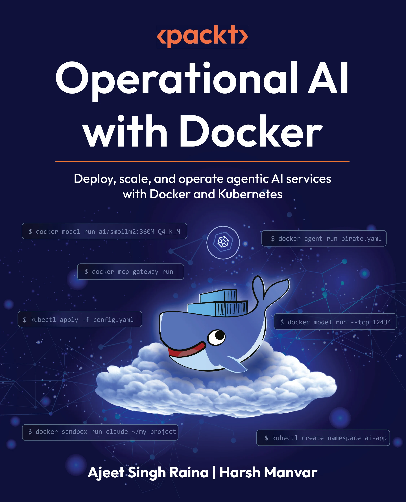

# [Книга] [Ajeet Singh Raina, Harsh Manvar] Практическое внедрение ИИ с Docker: LLMOps, агенты и мультимодельные системы на Docker и Kubernetes [ENG, 2026]

> Создавайте, развёртывайте и масштабируйте готовые к эксплуатации ИИ-приложения с помощью интегрированного набора инструментов Docker для работы с ИИ.

**Оригинальный код книги:**  
https://github.com/PacktPublishing/Operational-AI-with-Docker

Эта книга предназначена для DevOps-инженеров, инженеров платформ, специалистов по ИИ и машинному обучению, архитекторов решений и разработчиков, которые хотят внедрять ИИ-приложения в рабочую среду. Независимо от того, разворачиваете ли вы свою первую большую языковую модель (LLM) или создаёте сложные системы с несколькими ИИ-агентами, в этой книге вы найдёте практические рекомендации по использованию Docker для запуска ИИ-приложений в production.

## О чём эта книга

Если вы когда-нибудь хотели превратить ИИ-приложение из «у меня на ноутбуке работает» в приложение, которое действительно можно запустить в production, эта книга для вас. В ней рассматривается весь жизненный цикл: запуск локальных больших языковых моделей (LLM), подключение их к реальным приложениям, интеграция внешних инструментов через MCP, создание автономных агентов и, наконец, оркестрация целых групп агентов в Kubernetes — с помощью инструментов Docker для работы с ИИ.

Вы будете на практике работать с Docker Desktop, Docker Model Runner, MCP Gateway, Docker Hardened Images и kagent. Вы также узнаете, как знакомые вам контейнеры могут безопасно и масштабно запускать ИИ-нагрузки.

## Путеводитель по главам

| № | Глава | Содержание |
|---|---|---|
| 1 | **Введение в контейнеризацию для ИИ** | Основы Docker с точки зрения ИИ и машинного обучения: образы, контейнеры, реестры и сравнение контейнеров с виртуальными машинами. Два небольших примера (`tiny-service-container` и `tiny-training-run`) помогут освоить `docker run` и `docker build`, прежде чем перейти к более сложным задачам. |
| 2 | **Знакомство с моделями ИИ в Docker** | Переход от «я знаю Docker» к «я умею развёртывать модели». Рассматриваются артефакты OCI, формат GGUF, квантование и новый синтаксис `models:` в Compose для объявления зависимостей от моделей наряду с сервисами. |
| 3 | **Обслуживание моделей с помощью Docker Model Runner** | Основа локального рабочего процесса с LLM. Вы научитесь загружать модели из Docker Hub, обращаться к ним через API, совместимый с OpenAI, создавать чат-бота на React и подключать Prometheus, Grafana и Jaeger для наблюдаемости. Включены примеры SDK для Python и JavaScript. |
| 4 | **Docker Offload** | Перенос ресурсоёмких задач — экспорта моделей, квантования и пакетной обработки — в специализированные контейнеры, чтобы основное приложение работало быстро. Включён готовый конвейер `export_and_quantize.py`. |
| 5 | **Запуск контейнерных моделей машинного обучения в Kubernetes** | Развёртывание контейнеризированных моделей в реальном кластере. Манифесты, ограничения ресурсов, автомасштабирование и небольшая экосистема машинного обучения, которую можно развернуть целиком. |
| 6 | **Интеграция ИИ на основе протоколов с MCP** | Модели получают возможность выполнять действия. С помощью Docker MCP Gateway и каталога MCP, включающего более 270 серверов, вы подключите ИИ к базам данных, API и инструментам — с надлежащей изоляцией, управлением секретами и поддержкой OAuth. |
| 7 | **Создание автономных ИИ-агентов** | Переход от «ИИ, который отвечает» к «ИИ, который действует». Рассматриваются изолированные в контейнерах агенты, взаимодействие между агентами, обнаружение, память и состояние, рассуждение, доступ к инструментам и песочницы. Каждая тема вынесена в отдельную подпапку. |
| 8 | **Архитектуры с несколькими моделями и агентами** | Что делать, когда одного агента недостаточно: маршрутизация задач по сложности, координация специализированных моделей и создание работающего исследовательского помощника на основе нескольких агентов. |
| 9 | **Продвинутая оркестрация агентов** | Защита выполнения агентов с помощью Docker Sandboxes. Декларативные команды агентов на базе Docker Agent. Развёртывание производственных групп агентов в Kubernetes с помощью `kagent`. Автоматическая регистрация, обнаружение узлов, распределённая трассировка и выполнение в песочнице для реальных рабочих нагрузок. |

 

## Необходимые знания и инструменты

Вам не нужно быть экспертом по ИИ, но важно уверенно пользоваться командной строкой. Понадобятся:

**[!!!] Docker Desktop не использую, поэтому не все работает как в книге!** 

Было бы круто получить исправления в тех местах, где из-за этого не запускается.

- **Docker и Compose v2**
- **Git** для клонирования репозитория
- **Около 16 ГБ оперативной памяти** — рекомендуется для комфортного запуска локальных LLM. Видеокарта поможет, но не обязательна.
- **`kubectl` и локальный кластер Kubernetes** — `kind` или `minikube`. Это понадобится только для глав 5 и 9.
- Базовое понимание Docker и того, что такое LLM.

Примеры запускаются на Linux.

## Чему вы научитесь

- Запускать и оптимизировать локальные LLM с помощью Docker Model Runner.
- Интегрировать ИИ-приложения с внешними системами через MCP (Model Context Protocol).
- Безопасно развёртывать MCP-серверы с помощью Docker MCP Gateway.
- Создавать автономных ИИ-агентов и архитектуры с несколькими агентами.
- Обеспечивать безопасность production-среды с помощью Docker Hardened Images.
- Отслеживать работу ИИ-нагрузок с помощью Prometheus и Grafana.
- Интегрировать ИИ с GitHub, Slack, Kubernetes и базами данных.
- Масштабировать ИИ-приложения от разработки до production.
- Применять корпоративные подходы к защите ИИ-развёртываний.
- Автоматизировать рабочие процессы ИИ с помощью Docker Compose и инструментов оркестрации.
